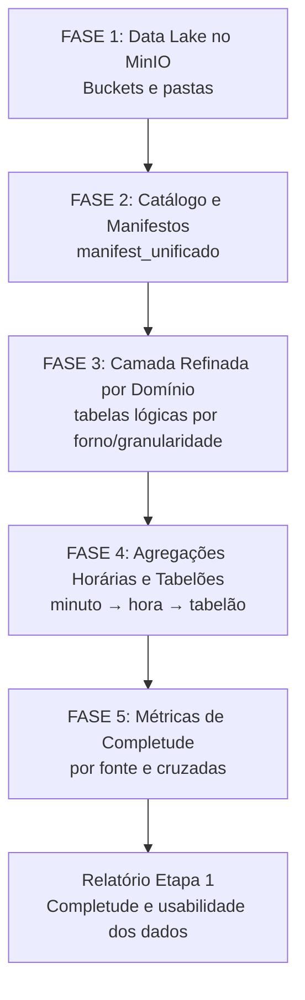

## 1. Objetivo do plano

Construir uma SSOT baseada em data lake no MinIO, em vez de uma única tabela monolítica, seguindo estes princípios:

1. Os dados entram primeiro em um repositório único, organizado por tipo/fonte/granularidade.
    
2. Só depois definimos as chaves de integração e as métricas de completude.
    
3. A granularidade de trabalho “padrão” para diagnóstico será a hora, mas preservando as bases originais (corrida, minuto, etc.).
    
4. A Etapa 1 termina com um relatório de completude, não com o modelo final de dados para Machine Learning.
    

---
> [!success] Fase concluída
## 2.  Fase 0 – Consolidação conceitual (já em andamento)

**Objetivo:** Congelar as decisões conceituais que já foram discutidas, para evitar refazer raciocínio depois.

Tarefas:

0.1. Registrar os princípios da SSOT como data lake:

- SSOT = MinIO + catálogo (manifestos + índices), não uma tabela única.
    
- Camadas: RAW → REFINADA → DERIVADOS (tabelões, visões de análise).
    
- Granularidades principais: corrida, minuto, hora, dia.
    

0.2. Vincular este plano à Etapa 1 do diagnóstico:

- Deixar claro no texto que o resultado desta fase é um “Relatório de Completude e Usabilidade dos Dados”, não ainda o modelo final de ML.
    

**Entregável:**  
Um arquivo `.md` no seu repositório Maringá consolidando estas decisões, que vira “referência oficial” para as fases seguintes.

---

## 3. Fase 1 – Organização física do data lake no MinIO

**Objetivo:** Definir e criar a estrutura física (buckets/pastas) que vai receber os arquivos, sem ainda transformá-los.

### 1.1. Definir buckets e camadas

Proposta (ajustável):

- `maringa-raw`
    
    - Todo arquivo original recebido na Etapa 1 (igual ao que veio do cliente ou do diretório de dados).
        
- `maringa-refined`
    
    - Arquivos padronizados por domínio (supervisório, corridas, laboratório, etc.).
        
- `maringa-derived`
    
    - Agregações horárias, “tabelões” e outras visões de diagnóstico/modelagem.
        
- `maringa-manifests`
    
    - Manifestos e índices de controle (inclusive versões tratadas de `manifest_index.csv` e `index_resumo_por_pasta.csv`).
        

### 1.2. Convenção de pastas dentro dos buckets

Dentro de cada bucket, seguir um padrão:

`<dominio>/<fonte>/<forno>/<granularidade>/<ano>/<mes>/arquivo.ext`

Exemplos:

- `supervisorio/F4/minuto/2023/01/...`
    
- `supervisorio/F4/hora/2023/01/...` (derivado)
    
- `corridas/F4/corrida/2023/01/...`
    
- `laboratorio/ligas/2023/01/...`
    

### 1.3. Tarefas concretas

- 1.3.1. Definir a lista de domínios/fonte (ex.: `supervisorio`, `corridas`, `energia`, `laboratorio`, `medicoes_eletrodo`, etc.).
    
- 1.3.2. Definir a lista de fornos e seus identificadores “oficiais” (F1, F2, F3, F4, F5, etc.).
    
- 1.3.3. Mapear os arquivos já listados em `manifest_index.csv` e `index_resumo_por_pasta.csv` para esses domínios/fornos.
    
- 1.3.4. Mover os arquivos do ambiente atual para o bucket `maringa-raw`, obedecendo ao novo padrão de pastas.
    

**Entregáveis:**

- Estrutura de buckets criada no MinIO.
    
- Documentação curta em `.md` descrevendo a árvore de diretórios e as convenções de nomes.
    

---

## 4. Fase 2 – Catálogo e classificação dos arquivos (manifestos)

**Objetivo:** Transformar `manifest_index.csv` e `index_resumo_por_pasta.csv` em um catálogo robusto, que descreve tudo o que existe no data lake.

### 2.1. Modelo lógico do catálogo

Definir um “manifesto unificado” com campos mínimos:

- `id_arquivo` (chave técnica do manifesto)
    
- `bucket`
    
- `dominio`
    
- `fonte`
    
- `forno`
    
- `granularidade_original` (corrida, minuto, hora, dia)
    
- `periodo_inicio`
    
- `periodo_fim`
    
- `path_no_bucket`
    
- `nome_arquivo_original`
    
- `status_refino` (raw, refinado, derivado)
    
- `tabela_logica_associada` (quando já houver tabela refinada correspondente)
    
- `observacoes`
    

### 2.2. Integração dos arquivos de índice já existentes

- 2.2.1. Ler e harmonizar `manifest_index.csv` e `index_resumo_por_pasta.csv` em um único manifesto de controle.
    
- 2.2.2. Corrigir/normalizar nomes de domínios, fontes e fornos para bater com o padrão da Fase 1.
    
- 2.2.3. Preencher, sempre que possível, `periodo_inicio`, `periodo_fim` e `granularidade_original`.
    

### 2.3. Classificação por critérios de campos essenciais

Usando o documento `criterios_campos_essenciais.md`:

- 2.3.1. Associar a cada arquivo/tabela uma “família de variáveis” (por exemplo: processo térmico, energia, qualidade, distância eletrodo, etc.).
    
- 2.3.2. Marcar no manifesto se aquele arquivo/tabela contém ou não campos considerados “essenciais” para:
    
    - ser usado no cálculo da distância da ponta do eletrodo;
        
    - compor os modelos physics-based;
        
    - compor modelos supervisionados/não supervisionados.
        

**Entregáveis:**

- Um `manifest_unificado.csv` (ou Parquet) com todas as colunas definidas.
    
- Um `.md` explicando o modelo lógico do manifesto e como ele será mantido.
    

---

## 5. Fase 3 – Camada refinada por domínio

**Objetivo:** Padronizar, por domínio, as tabelas que serão base para análise de completude e para os “tabelões”.

A lógica aqui é: refino por domínio, sem ainda integrar tudo em uma única tabela.

### 3.1. Definir “tabelas lógicas” por domínio e granularidade

Exemplos (ajuste depois com mais precisão):

- `supervisorio_F4_minuto`
    
- `supervisorio_F5_minuto`
    
- `supervisorio_F4_hora` (derivado)
    
- `corridas_F4`
    
- `corridas_F5`
    
- `energia_F4_hora`
    
- `laboratorio_corridas`
    

Para cada tabela lógica, definir:

- nome oficial;
    
- chave primária lógica (por exemplo: forno + timestamp, forno + corrida, etc.);
    
- granularidade;
    
- principais variáveis e tipos de dados.
    

### 3.2. Padronização de colunas e tipos

Para cada tabela lógica:

- 3.2.1. Padronizar nomes de colunas (snake_case, sem espaços, sem acentos).
    
- 3.2.2. Garantir que `timestamp` esteja em um formato único (UTC ou hora local, mas padronizado).
    
- 3.2.3. Tipar colunas (numérico, categórico, booleano, texto) de forma consistente.
    
- 3.2.4. Alinhar unidades (por exemplo, potência sempre em MW, energia em MWh, etc., quando decidido).
    

### 3.3. Registro no manifesto

- 3.3.1. Para cada tabela refinada criada, registrar no `manifest_unificado`:
    
    - `status_refino = refinado`;
        
    - o caminho no `maringa-refined`;
        
    - o mapeamento entre arquivos RAW e a tabela refinada.
        

**Entregáveis:**

- Conjunto de arquivos Parquet/CSV em `maringa-refined` por domínio.
    
- Documentação `.md` com a definição de cada tabela lógica (dicionário de dados resumido).
    

---

## 6. Fase 4 – Agregações horárias e “tabelões” derivados

**Objetivo:** Criar visões derivadas em granularidade horária e, a partir delas, “tabelões” para diagnóstico e modelagem, sem transformar isso na SSOT física.

### 4.1. Agregações minuto → hora nos supervisórios

Para cada supervisório em minuto:

- 4.1.1. Definir quais variáveis serão agregadas por hora.
    
- 4.1.2. Definir as estatísticas por hora:
    
    - média, mínimo, máximo, desvio-padrão;
        
    - `n_valid` (minutos válidos);
        
    - `n_expected` (minutos esperados, tipicamente 60);
        
    - `cobertura = n_valid / n_expected`;
        
    - flag de “hora suspeita” quando cobertura < limiar (por exemplo, 0,8).
        
- 4.1.3. Gerar tabelas como:
    
    - `supervisorio_F4_hora`
        
    - `supervisorio_F5_hora`
        
    - etc.
        

### 4.2. Construção de “tabelões” por hora

Aqui definimos explicitamente quais combinações vamos olhar na Etapa 1, por exemplo:

- “Tabelão operacional horário por forno”:
    
    - chave: forno + timestamp_hora;
        
    - variáveis: produção, energia, métricas do supervisório, flags de cobertura, etc.
        
- 4.2.1. Definir um ou dois “tabelões” prioritários:
    
    - por forno-hora (foco em operação contínua);
        
    - eventualmente por corrida (quando fizer sentido).
        
- 4.2.2. Registrar esses “tabelões” como derivados no manifesto:
    
    - `status_refino = derivado`;
        
    - caminho no bucket `maringa-derived`.
        

**Entregáveis:**

- Tabelas horárias derivadas em `maringa-derived`.
    
- Especificação `.md` dos “tabelões” (chaves, colunas, origem de cada variável).
    

---

## 7. Fase 5 – Métricas de completude e relatório da Etapa 1

**Objetivo:** Medir, de forma objetiva, a completude dos dados e produzir o relatório final da Etapa 1.

### 5.1. Métricas de completude por fonte e por tabela refinada

Para cada tabela refinada:

- 5.1.1. Medir:
    
    - cobertura temporal (quantos dias/horas/corridas existem por forno);
        
    - % de preenchimento de cada campo essencial (segundo `criterios_campos_essenciais`).
        
- 5.1.2. Gerar resultados agregados por:
    
    - forno;
        
    - período (por exemplo, mês/ano);
        
    - tipo de variável (processo térmico, energia, qualidade, distância eletrodo, etc.).
        

### 5.2. Métricas de completude cruzada (integração entre fontes)

Usando os “tabelões”:

- 5.2.1. Medir, por forno e período:
    
    - para quantas horas temos supervisório + energia;
        
    - para quantas corridas temos corridas + laboratório + supervisório;
        
    - em qual fração do tempo temos todos os dados necessários para modelos:
        
        - physics-based;
            
        - supervisionados;
            
        - não supervisionados.
            

### 5.3. Relatório da Etapa 1

- 5.3.1. Estruturar o relatório em texto corrido, com capítulos:
    
    - descrição das fontes e do data lake;
        
    - metodologia de refino e de agregação;
        
    - métricas de completude por fonte;
        
    - métricas de completude cruzada;
        
    - implicações para modelos de:
        
        - distância da ponta do eletrodo;
            
        - demais modelos physics-based;
            
        - modelos supervisionados/não supervisionados.
            
- 5.3.2. Incluir gráficos e tabelas de:
    
    - cobertura temporal;
        
    - completude de campos essenciais;
        
    - matriz “fonte x tipo de modelo x nível de cobertura”.
        

**Entregáveis:**

- Arquivo `.md` (base para Obsidian) do relatório da Etapa 1.
    
- Eventuais figuras exportadas (png/svg) com os gráficos principais.
    

---

## 8. Visão visual (Mermaid) do fluxo

